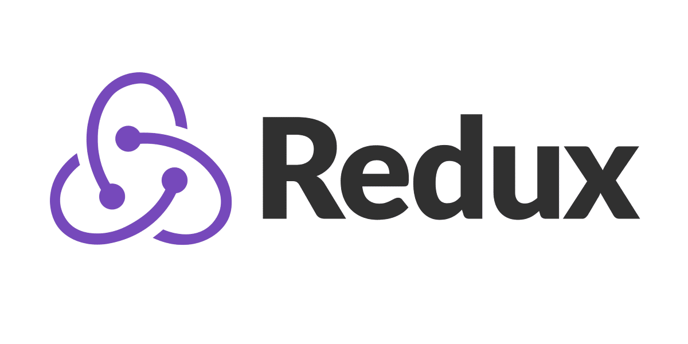

# 👨‍🎓 LEARNING REDUX AND REDUX TOOLKIT

> This repository is dedicated to my Redux and Redux Toolkit studies

## 📖 Study References

**Course Link:** [The Ultimate Redux Course 2023 - LATEST Redux-toolkit](https://www.udemy.com/course/the-ultimate-redux-course-state-management-library/)

**Course Sections:**

* [**3️⃣ Section 3:** Basics of Redux - Fundamentals](/sections-code/section3/)
* [**4️⃣ Section 4:** Debugging on Redux](/sections-code/section4/)
* [**5️⃣ Section 5:** Mastering Redux Toolkit](/sections-code/section5/)
* [**6️⃣ Section 6:** Middleware on Redux](/sections-code/section6/)
* [**7️⃣ Section 7:** Callgin API With Redux](/sections-code/section7/)
* [**8️⃣ Section 8:** Redux With ReactJS](/sections-code/section8/)

## 🤝 Colaborators

<table>
  <tr>
    <td align="center">
      <a href="#">
         
        
          <b>Vinícius Gabriel</b>
        
      </a>
    </td>
  </tr>
</table>

[⬆ Back to start](#-learning-docker) 
